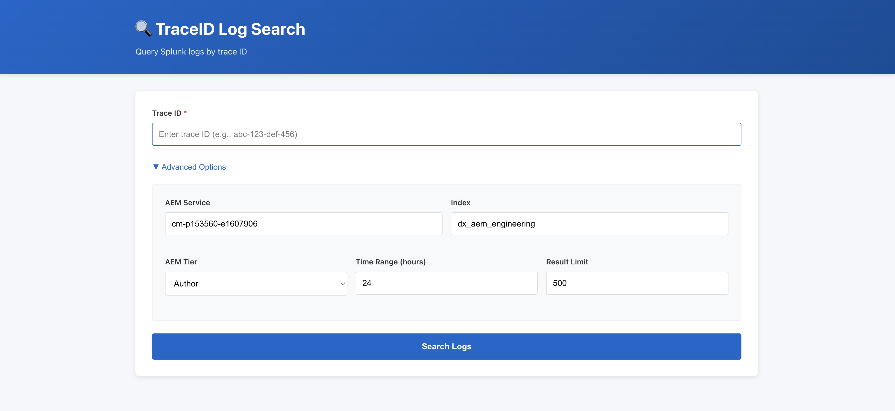
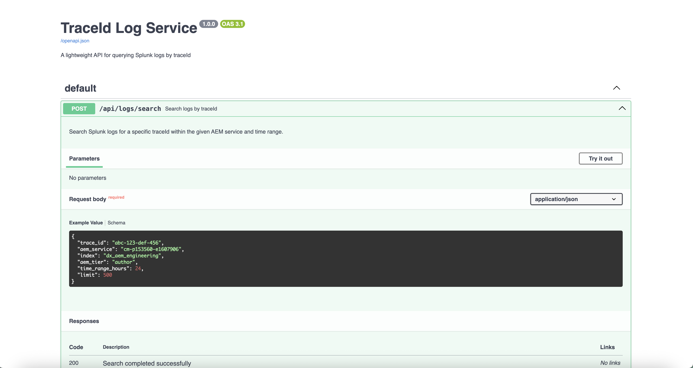

# TraceID Log Service

A lightweight web application for querying Splunk logs by trace ID with a React frontend and FastAPI backend.







## Features

- 🔍 Search Splunk logs by trace ID
- 🔐 **API Key authentication** - Secure access control
- 🎨 Modern React UI with JSON viewer
- ⚙️ Configurable search parameters (AEM service, index, tier, time range)
- 🚀 Fast API built with FastAPI
- 📊 Results displayed with syntax highlighting
- 📋 Copy logs to clipboard
- 🔒 HashiCorp Vault integration for secrets (optional)

## Architecture

```
┌─────────────┐
│   Browser   │
└──────┬──────┘
       │ HTTP
       ↓
┌─────────────────┐
│  FastAPI        │
│  Backend        │ ← Serves React frontend (static files)
│  (Port 8002)    │ ← Provides /api/logs/search endpoint
└────────┬────────┘
         │
         ↓
┌─────────────────┐
│  Splunk API     │
└─────────────────┘
```

## Quick Start

### Prerequisites

- Python 3.9+
- [uv](https://docs.astral.sh/uv/) - Fast Python package installer
- Bun or Node.js 18+ (for frontend)
- Splunk credentials
- Access to Adobe Splunk API

Install uv if you haven't:
```bash
curl -LsSf https://astral.sh/uv/install.sh | sh
```

### 1. Backend Setup

```bash
# Install dependencies (uv creates virtual environment automatically)
uv sync

# Configure environment variables
cp .env.example .env
# Edit .env with your Splunk credentials
```

Required environment variables:
```bash
# Generate API key first
API_KEY=$(python3 -c "import secrets; print(secrets.token_urlsafe(32))")
echo "API_KEY=$API_KEY" >> .env

# Add Splunk credentials
SPLUNK_HOST=splunk-api.or1.adobe.net
SPLUNK_USER=your-username
SPLUNK_PASS=your-password
SPLUNK_PORT=443
SPLUNK_SCHEME=https
```

### 2. Frontend Setup

```bash
cd frontend

# Install dependencies
bun install  # or: npm install

# Build the frontend
bun run build  # or: npm run build
```

This builds the React app into the `../static/` directory.

### 3. Run the Application

```bash
# From the project root
uv run python main.py
```

Or run with uvicorn directly:
```bash
uv run uvicorn main:app --host 0.0.0.0 --port 8002
```

The application will be available at: **http://localhost:8002**

- Frontend: `http://localhost:8002/` (login with API key)
- API: `http://localhost:8002/api/logs/search`
- Health check: `http://localhost:8002/health`

**First time login:** Enter the API_KEY you set in `.env` file

## Development

### Backend Development

The FastAPI backend provides automatic API documentation:
- Swagger UI: `http://localhost:8002/docs`
- ReDoc: `http://localhost:8002/redoc`

### Frontend Development

For frontend development with hot reload:

```bash
cd frontend
bun run dev
```

This starts a Vite dev server at `http://localhost:5173` with proxy configuration to forward API requests to the backend at port 8002.

When done developing, rebuild the frontend:

```bash
bun run build
```

## API Endpoints

### Search Logs

**POST** `/api/logs/search`

Request body:
```json
{
  "trace_id": "abc-123-def-456",
  "aem_service": "cm-p153560-e1607906",
  "index": "dx_aem_engineering",
  "aem_tier": "author",
  "time_range_hours": 24,
  "limit": 500
}
```

Response:
```json
{
  "success": true,
  "trace_id": "abc-123-def-456",
  "total_count": 42,
  "logs": [
    {
      "_time": "2024-01-15T10:30:00.000Z",
      "level": "ERROR",
      "msg": "Error message here",
      "_raw": "Full log line...",
      ...
    }
  ],
  "query_time_seconds": 1.23
}
```

### Health Check

**GET** `/health`

Response:
```json
{
  "status": "healthy",
  "service": "traceid-log-service"
}
```

## Authentication

This application is protected with API Key authentication. All users must log in with a valid API key.

### Generating an API Key

```bash
python3 -c "import secrets; print(secrets.token_urlsafe(32))"
```

### Setting Up

1. **Local Development:** Add `API_KEY=your-generated-key` to `.env` file
2. **Render Deployment:** Set `API_KEY` as environment variable in Render dashboard
3. **Share with Users:** Send API key to authorized users via secure channel

See `AUTHENTICATION.md` for detailed security guidelines.

---

## Configuration

### Environment Variables

| Variable | Default | Description |
|----------|---------|-------------|
| `SPLUNK_HOST` | `splunk-api.or1.adobe.net` | Splunk API hostname |
| `SPLUNK_USER` | `service-account-username` | Splunk username |
| `SPLUNK_PASS` | *required* | Splunk password |
| `SPLUNK_PORT` | `443` | Splunk API port |
| `SPLUNK_SCHEME` | `https` | HTTP scheme (http/https) |
| `MAX_RETRIES` | `3` | Maximum query retry attempts |
| `DEFAULT_TIME_RANGE_HOURS` | `24` | Default search time range |
| `MAX_TIME_RANGE_HOURS` | `168` | Maximum allowed time range (7 days) |
| `DEFAULT_LIMIT` | `500` | Default result limit |
| `LOG_LEVEL` | `INFO` | Logging level |

### HashiCorp Vault (Optional)

For production, use Vault to manage secrets:

```bash
VAULT_ADDR=https://vault-amer.adobe.net
VAULT_ROLE_ID=your-role-id
VAULT_SECRET_ID=your-secret-id
VAULT_SECRET_PATH=your/secret/path
```

If Vault credentials are provided, the service will fetch `SPLUNK_PASS` from Vault. Otherwise, it falls back to environment variables.

## Project Structure

```
traceid-log-service/
├── main.py                 # FastAPI application
├── config.py               # Configuration and Vault integration
├── models.py               # Pydantic models
├── splunk_client.py        # Splunk API client
├── pyproject.toml          # Project metadata and dependencies
├── uv.lock                 # Locked dependency versions
├── frontend/               # React application
│   ├── src/
│   │   ├── App.jsx
│   │   ├── components/
│   │   │   ├── SearchForm.jsx
│   │   │   └── LogViewer.jsx
│   │   └── services/
│   │       └── api.js
│   ├── package.json
│   └── vite.config.js
└── static/                 # Built frontend (generated)
    ├── index.html
    └── assets/
```

## Deployment

### Building for Production

1. Build the frontend:
```bash
cd frontend && bun run build && cd ..
```

2. Set production environment variables

3. Run with a production ASGI server:
```bash
uv run uvicorn main:app --host 0.0.0.0 --port 8002 --workers 4
```

### Docker (Optional)

A Dockerfile can be created to containerize the application:

```dockerfile
FROM python:3.11-slim

# Install uv
COPY --from=ghcr.io/astral-sh/uv:latest /uv /usr/local/bin/uv

# Install Node/Bun for building frontend
RUN curl -fsSL https://bun.sh/install | bash

WORKDIR /app
COPY . .

# Install Python dependencies
RUN uv sync --frozen

# Build frontend
RUN cd frontend && ~/.bun/bin/bun install && ~/.bun/bin/bun run build

# Run application
CMD ["uv", "run", "uvicorn", "main:app", "--host", "0.0.0.0", "--port", "8002"]
```

